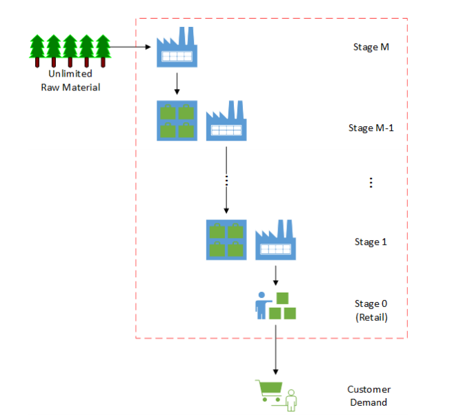
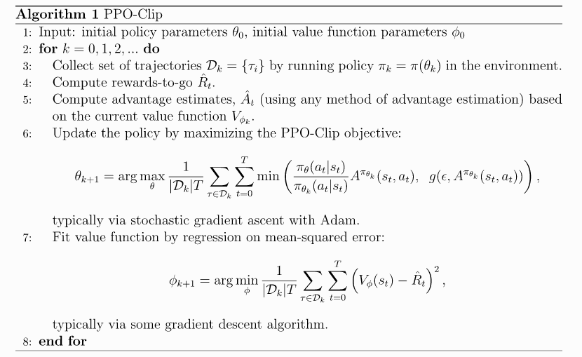
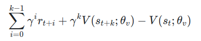
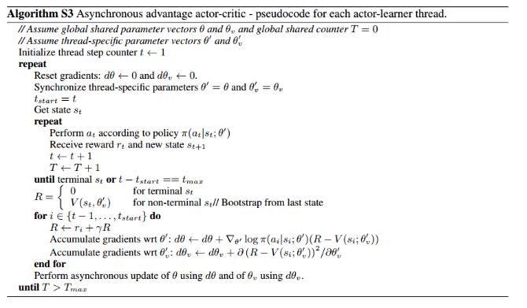
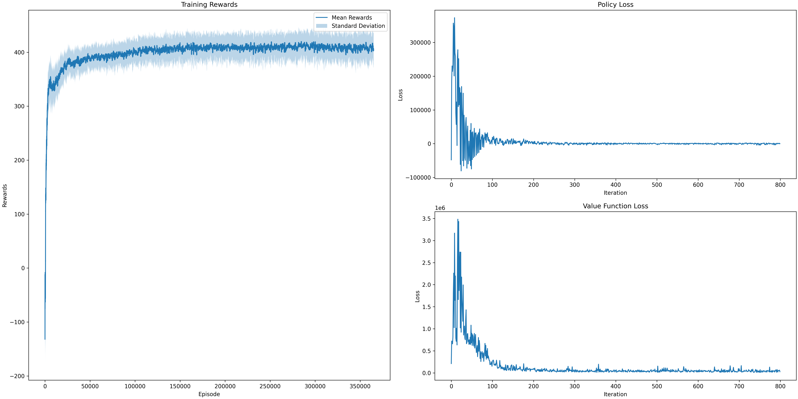
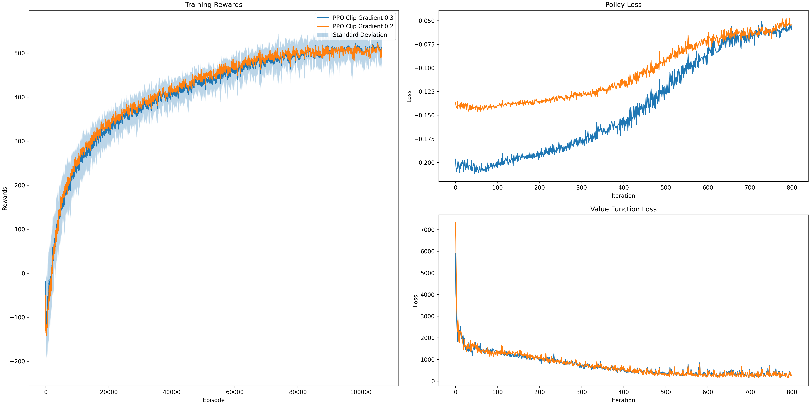

<h1> Comparison of Proximity Policy Optimization  and Asynchronous Advantage Actor-Critic on Multi - Echelon Inventory Optimization Model </h1>
<h2> Introduction to Reinforcement Learning </h2>

  Reinforcement learning is the study of agents that act in an environment with the goal of maximizing cumulative reward signals. The agent is not told which actions to take but discovers which actions yield the most rewards by trying them. Its action may affect not only the immediate rewards but rewards for the next situations. There are several methods to solve the reinforcement learning problems namely <strong> Armed Bandit Problem, Markov Decision Process, Dynamic Programming, Temporal Differencing, etc.</strong> One of the challenges in the RL problem is the exploration versus exploitation problem, which is the trade-off between obtaining rewards from perceived safe options against exploring other possibilities which may be advantageous.

An RL problem can be divided into four sub elements: policy, reward function, value function, and a model. A policy specifies how an agent behaves in a given scenario, a reward function defines the goal in RL problem, a value function maps a state to an estimate of the total reward an agent can expect to accumulate over the future starting from that state and a model is an optional element of the RL system.
  

  

  <h2>OR - Gym Environment </h2>

OR-GYM is a toolkit for reinforcement learning research problems namely in the field of Operation Research that contains a growing collection of Operation Research problems like <strong> knapsack-v0, knapsack-v1, Binpacking, Vehicle Routing, Inventory Management, Network Management, etc. </strong> It is an open-source python library for developing the applications of reinforcement learning algorithms on OR problems. This library provides RL benchmark using the Ray package for a selection of these problems,as well as heuristic and optimal solutions. Each of the environments that are available in the OR-gym package is easily customizable via configuration dictionaries that can be passed to the environments upon initialization. All the mathematical programming models are solved with Gurobi 8.2 and Pyomo 5.6.2 to optimality on a 2.9  GHz Intel CPU.

<h2>Multi-Echelon Inventory Management </h2>

Modern supply chains are intricate networks that span the world. Supply networks that are efficient are able to control costs and deliver goods to clients with little delays and interruptions. Inventory management is an important part in achieving these goals, based on Glasserman and Tayur’s work [3], which depicts a single-product, multi-period, serial capacitated supply chain with production and inventory holding locations at each echelon.

  
  
To be specific, A shop encounters erratic consumer demand on a daily basis and must maintain inventory at a cost to accommodate that demand. If the retailer fails to meet that demand, it will either be recognized as a backlog order, which can be filled at a later date with a lesser profit margin (InvManagement-v0), or it will simply be written off as a lost sale with no profit margin (InvManagement-v1). Every day, the retailer must decide how much inventory to order from its distributor, who will manufacture the goods and distribute it to the store within a certain time frame. In a multi-echelon supply chain, the distributor will have a supplier, who may have a supplier above them, and so on, until the supply chain reaches the original party who consumes the raw materials

  

<h2>Reinforcement Learning Methods <h2>
  
  

    In this section we first describe the problem, then two techniques we first select to solve, including Q learning,Proximal Policy Optimization (PPO) and Asynchronous Advantage Actor-Critic (A3C) methods .
  

  
  <h2>Problem Decription</h2>
  
  In our case, we have M stages going back to the producer of our raw materials all the way to our customers. Each stage along the way has a different lead time, or time it takes for the output of one stage to arrive and become the input for the next stage in the chain. This may be 5 days, 10 days, whatever. The longer these lead times become, the earlier you need to anticipate customer orders and demand to ensure you don’t stock out or lose sales.
This is a four-echelon supply chain by default. The actions determine how much material to order from the echelon above at each time step. The orders quantities are limited by the capacity of the supplier and their current inventory. Each echelon has its own costs structure, pricing, and lead times. The last echelon (3 in this case) provides raw materials, and we don’t have any inventory constraints on this stage.
As this problem contains both continuous action values and continuous state environment values, we cannot apply a simple Q-learning method or Deep Q Method as these methods require discrete action value or discrete state environment values.
Even though binning is possible for continuous state environment values or continuous action values, that would increase the complexity of the problem exponentially. 
   

  
  <h2>InvManagement-v1 Environment </h2> 
  At each time period in the IMP, the following sequence of events occurs: 
 <ul> 
<li>Stages 0 through M − 1 place replenishment orders to their respective suppliers. Replenishment orders are filled according to available production capacity and available inventory at the respective suppliers. Lead times between stages include both production times and transportation times.</li> 
<li>Stages 0 through M − 1 receive incoming inventory replenishment shipments that have made it down the product pipeline after the associated lead times have passed. </li>
<li>Customer demand occurs at stage 0 (the retailer) and is filled according to the available inventory at that stage.</li> 
<li>One of the following occurs at each stage, (a) Unfulfilled sales and replenishment orders are backlogged at a penalty. Note: Backlogged sales take priority in the following period. (b) Unfulfilled sales and replenishment orders are lost with a goodwill loss penalty. </li>
<li>Surplus inventory is held at each stage at a holding cost.</li>
  </ul>
  
 <h2>Proximal Policy Optimization (PPO) </h2>
  
 
The PPO algorithm was introduced by the OpenAI team in 2017 and quickly became one of the most popular RL methods usurping the Deep-Q Learning method. It involves collecting a small batch of experiences interacting with the environment and using that batch to update its decision-making policy. Once the policy is updated with this batch, the experiences are thrown away and a newer batch is collected with the newly updated policy. This is the reason why it is an “on-policy learning” approach where the experience samples collected are only useful for updating the current policy once.
The key contribution of PPO is ensuring that a new update of the policy does not change it too much from the previous policy. This leads to less variance in training at the cost of some bias, but ensures smoother training and also makes sure the agent does not go down an unrecoverable path of taking senseless actions. So, let’s go ahead and breakdown our AI agent into more details and see how it defines and updates its policy.

 
   
   
PPO comes up with a clipping mechanism which clips the rt between a given range and does not allow it to go further away from the range.   
   
 where 
   <ul>
     <li>θ is the policy parameter   </li>
     <li> Êt denotes the empirical expectation over timesteps  </li>
     <li> Rt is the ratio of the probability under the new and old policies, respectively  </li>
     <li> t is the estimated advantage at time   </li>
     <li>ε is a hyperparameter, usually 0.1 or 0.2   </li>
  </ul>
  
  <strong>Pseudo Code </strong>

 

  

  
   <h2>Asunchronous Advantage Actor Critic</h2>
   

     A3C stands for Asynchronous Advantage Actor-Critic. Asynchronous means running multiple agents instead of one, updating the shared network periodically and asynchronously. Agents update independently of the execution of other agents when they want to update their shared network.
The algorithm, which we call asynchronous advantage actor-critic (A3C), maintains a policy π(at|st; θ) and an estimate of the value function V (st; θv). Like our variant of n-step Q-learning, our variant of actor-critic also operates in the forward view and uses the same mix of n-step returns to update both the policy and the value-function. The policy and the value function are updated after every tmax actions or when a terminal state is reached. The update performed by the algorithm can be seen as:
     
 
     
  where A(st, at; θ, θv) is an estimate of the advantage function given by  where k can vary from state to state and is upper-bounded
     
<strong>Pseudo Code</strong>     
     
 

  
 
  <h2>Implementation and Experimental Setup</h2>
  
The OR-Gym library has a multi-echelon supply chain model that can simulate the structure shown in the Introduction above. For this we are the “InvManagement-v1” environment, but results in lost sales if you don't have sufficient inventory to meet the customer’s demand.
Each echelon has its own cost structure, pricing and lead time. The last echelon provides raw materials and we don't have any inventory constraints on this stage, assuming that the producer which provides you with the raw materials is large enough that isn't a constraint we need to concern ourselves with.

For this problem we customized our parameters of <strong> Initial Inventory, Units sales Prices, Units Replenishment Cost, Unit backlog Cost, Unit Holding Cost, Production Capacity and Lead times.</strong>
    
    
For training the environment with different Reinforcement learning methods we leveraged Ray library, a multi-processing library that enables us to scale training to large-scale distributed servers or just take advantage of the parallelization properties to more efficiently train using any local device.

The various algorithms are available through ray.rllib.agents. All the algorithms contain specific hyperparameters which can be fine tuned to optimise our model. For PPO, we performed the fine tuning for the changing the <strong>Clip Gradient </strong>parameter to different values <strong>0.1, 0.2 and 0.3 </strong> and keeping the <strong>learning rate as  1x10-5</strong>.    

   We then  compared the performance of PPO with these different parameter with the Asynchronous Actor-Critic Method (A3C) method using <strong> Episode vs Rewards plot, Policy Loss plot and Loss function plot.</strong>  
    
   

  
  <h2>Results and Observation </h2>
  
  

    We compare PPO with A3C method which are considered to be effective for continuous problems. We compared against tuned implementation of the following algorithms
  

  <ul>
    <li><strong>A3C </strong> -  Running the model for about 350000+ episodes </li>

 
        
 <li><strong>PPO </strong> -  Learning rate : 1x10-5  and Clip Gradient : [0.2, 0.3] </li>

 

  </ul>
    <h2>Conclusion  </h2>
    
From the results obtained from the plots we can infer that PPO might not converge faster than Asynchronous Advantage Actor-Critic method but have better reward values as the number of episodes increases and thus converges on high reward values compared to the A3C method.

So in conclusion, we have introduced proximal policy optimization method, a family of policy optimizing methods that use multiple epochs of stochastic gradient ascent to perform each policy update. These methods have stability and reliability of trust-region methods but are much simpler to implement, requiring only a few lines of code change to a vanilla policy gradient implementation, applicable in more general settings.
   

  
  
  
  
  
  
  
  
  
  
  
  
  
  

